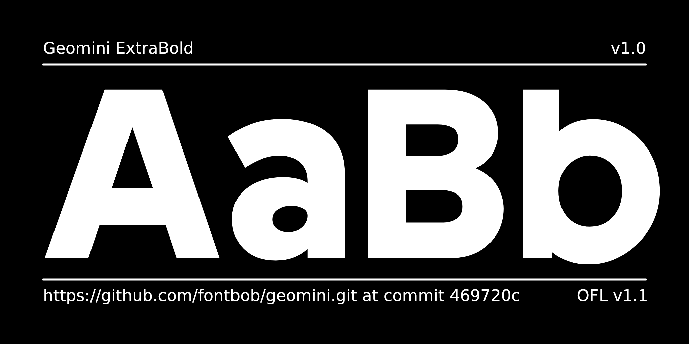
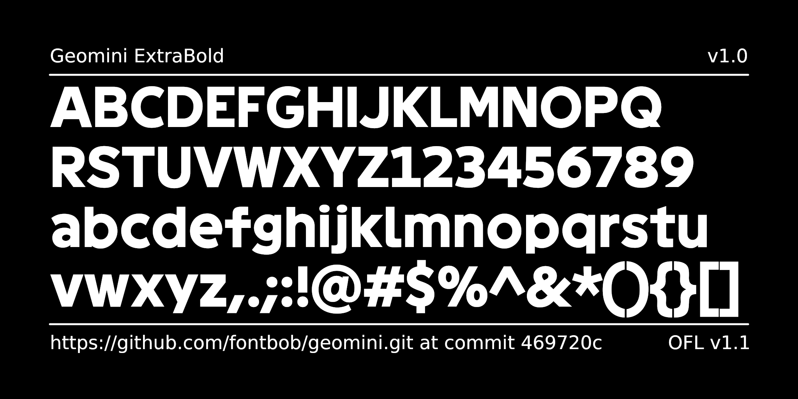

# Geomini font

[![][Fontspector]](https://fontbob.github.io/geomini/fontspector/fontspector-report.html)
[![][OpenType]](https://fontbob.github.io/geomini/fontspector/fontspector-report.html)
[![][Universal]](https://fontbob.github.io/geomini/fontspector/fontspector-report.html)
[![][Google Fonts]](https://fontbob.github.io/geomini/fontspector/fontspector-report.html)
[![][Glyphset]](https://fontbob.github.io/geomini/fontspector/fontspector-report.html)

[Fontspector]: https://img.shields.io/endpoint?url=https%3A%2F%2Ffontbob.github.io%2Fgeomini%2Fbadges%2FFontspectorQA.json
[OpenType]: https://img.shields.io/endpoint?url=https%3A%2F%2Ffontbob.github.io%2Fgeomini%2Fbadges%2FOpentypeSpecificationChecks.json
[Universal]: https://img.shields.io/endpoint?url=https%3A%2F%2Ffontbob.github.io%2Fgeomini%2Fbadges%2FUniversalProfileChecks.json
[Google Fonts]: https://img.shields.io/endpoint?url=https%3A%2F%2Ffontbob.github.io%2Fgeomini%2Fbadges%2FFontFileChecks.json
[Outline Correctness]: https://img.shields.io/endpoint?url=https%3A%2F%2Ffontbob.github.io%2Fgeomini%2Fbadges%2FOutlineCorrectnessChecks.json
[Glyphset]: https://img.shields.io/endpoint?url=https%3A%2F%2Ffontbob.github.io%2Fgeomini%2Fbadges%2FGlyphsetChecks.json

Geomini is a compact geometric font for text, titles and interfaces.

## About

This font is published by the FontBob team.

FontBob is a font editor focused on making type design more accessible.

## Building

Fonts are built automatically by GitHub Actions - take a look in the "Actions" tab for the latest build.

If you want to build fonts manually on your own computer:

- `make build` will produce font files.
- `make test` will run FontSpector quality assurance tests.
- `make proof` will generate HTML proof files.

The proof files and QA tests are also available automatically via GitHub Actions - look at https://fontbob.github.io/geomini.

## Changelog

When you update your font (new version or new release), please report all notable changes here, with a date.
[Font Versioning](https://github.com/googlefonts/gf-docs/tree/main/Spec#font-versioning) is based on semver.

**7 February 2026. Version 1.000**

- Initial Google Fonts submission.

## License

This Font Software is licensed under the SIL Open Font License, Version 1.1.
This license is available with a FAQ at https://openfontlicense.org

## Repository Layout

This font repository structure is inspired by [Unified Font Repository v0.3](https://github.com/unified-font-repository/Unified-Font-Repository), modified for the Google Fonts workflow.
