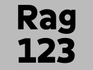

# Geomini font

Geomini is a geometric typeface font.

The family is designed and produced using FontBob, a browser-based font editor.

https://fontbob.com/geomini

## License

This font is licensed under the SIL Open Font License, Version 1.1.

See [OFL.txt](OFL.txt) for details.
